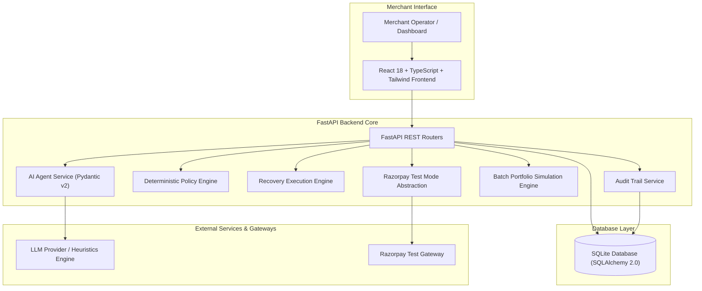

<div align="center">

# 🚀 RecoverIQ — AI Revenue Recovery Agent
### *Autonomous, Explainable, and Policy-Governed Revenue Recovery for Merchants*

[](https://fastapi.tiangolo.com)
[](https://reactjs.org)
[](https://www.typescriptlang.org)
[](https://tailwindcss.com)
[](https://razorpay.com)
[](https://pytest.org)
[](LICENSE)

**Razorpay Buildathon Track 3: AI Revenue Recovery**

[Features](#-key-features) • [Architecture](#-system-architecture) • [Demo Scenarios](#-6-recovery-playground-scenarios) • [Quick Start](#-quick-start--installation) • [API Docs](#-api-endpoints)

</div>

---

## 📌 Disclaimer
> **Synthetic & Test Data Notice:** All metrics, transaction records, customer histories, and recovery statistics presented in this application are generated from **Razorpay TEST MODE** APIs or deterministic **Synthetic / Demo Data**. RecoverIQ does **not** process live real-world merchant revenue or touch real money.

---

## 💡 1. Problem Statement & Mission

### The Core Problem
E-commerce and SaaS merchants lose significant revenue due to transient payment failures, UPI PSP timeouts, bank declines, network drops, and abandoned checkout flows.

- **Manual investigation is impossible at scale**: Merchants cannot manually triage hundreds of failed transactions daily.
- **Naive automated retries cause severe friction**: Indiscriminate retries cause customer frustration, bank decline fees, and card network penalties.
- **Generic chatbots cannot solve recovery**: Unconstrained LLMs cannot safely execute financial actions without strict, deterministic guardrails.

### The Solution: RecoverIQ
**RecoverIQ** is an autonomous fintech recovery agent that pairs structured AI reasoning with a deterministic safety policy engine:
1. **Detects** payment failures across merchant transactions in real-time.
2. **Diagnoses** the technical root cause (`UPI_TIMEOUT`, `BANK_DECLINED`, `INSUFFICIENT_FUNDS`, `NETWORK_ERROR`, `PAYMENT_METHOD_ERROR`).
3. **Understands Customer Context** (Lifetime Value, historical success/failure ratio, retry attempts).
4. **Predicts Recovery Probability** using a calibrated, Pydantic-validated reasoning model.
5. **Enforces Deterministic Safety Rules** through the Policy Engine before executing any payment action.
6. **Executes Safe Recovery** (`RETRY_PAYMENT`, `PAYMENT_LINK`, `ALTERNATIVE_PAYMENT_METHOD`, `REMINDER`, `HUMAN_ESCALATION`, `STOP`) on Razorpay Test Gateway.
7. **Quantifies Recovered Revenue** dynamically and logs an immutable audit trail.

---

## 🔄 2. Complete End-to-End Recovery Pipeline

```
FAILED PAYMENT
       ↓
DETECT (Gateway Webhook / Transaction Ingestion)
       ↓
DIAGNOSE (UPI Timeout vs Bank Decline vs Insufficient Funds)
       ↓
CUSTOMER CONTEXT (Lifetime Value, Success/Failure Ratio, Retry History)
       ↓
AI RECOMMENDATION (Pydantic-Validated Probability & Action Selection)
       ↓
POLICY VALIDATION (Deterministic Safety Guardrails: Max 2 Retries, High-Value Gate)
       ↓
RECOVERY ACTION (Razorpay Test Mode Order / Payment Link / Approval Queue)
       ↓
RECOVERY RESULT (Success / Pending / Gated / Stopped)
       ↓
REVENUE RECOVERED (+₹ Captured)
       ↓
DASHBOARD & AUDIT TRAIL (Dynamic SQLite Analytics & Immutable Compliance Log)
```

---

## 🏛️ 3. System Architecture



---

## 🛡️ 4. Key Architectural Modules

### 1. Deterministic Policy Engine (Guardrails)
The AI agent strictly *recommends*, but the **Policy Engine** has final binding authority:
- **Rule 1 (Max 2 Retries Ceiling)**: Enforces an absolute cap of 2 automatic retries. Exceeding retries forces `STOP`.
- **Rule 2 (High-Value Gate)**: Payments $\ge$ ₹20,000 are automatically gated for merchant sign-off in the Approval Queue.
- **Rule 3 (Repeated Failure Cap)**: Chronic failure histories ($\ge 3$ prior declines) trigger `STOP`.
- **Rule 4 (Minimum Probability Floor)**: If predicted recovery probability $< 25\%$ $\rightarrow$ forced `STOP`.
- **Rule 5 (Cooldown Window)**: Prevents rapid back-to-back retries within a 30-second window.
- **Rule 6 (Risky Action Escalation)**: High-risk assessments gate for human operator verification.
- **Rule 7 (100% Immutable Audit Logging)**: Every rule check produces an explainable checklist stored in the database.

### 2. Razorpay Test Mode & Simulation Abstraction
- Clean abstraction implemented in `RazorpayService`.
- Authenticates against official Razorpay APIs when `RAZORPAY_KEY_ID` and `RAZORPAY_KEY_SECRET` are configured in `.env`.
- Automatically activates **SIMULATION MODE** when credentials are unset, ensuring 100% uptime for demos.
- **Strict Security**: Secrets are **never exposed to the frontend** and **real money is never used**.

### 3. Explainable AI Reasoning Layer (Gemini 3.8 Flash)
- Powered by `gemini-3.8-flash` using structured JSON output validated against Pydantic schemas.
- Evidence-grounded root-cause diagnosis without unsupported issuer claims.
- Fallback to calibrated domain heuristics occurs only when external LLM APIs are unreachable, with transparent `fallback_used` audit logging.

### 4. No Fake Recovery & Strict Razorpay Test Mode
- **Zero Real Money**: Operates strictly in Razorpay TEST MODE or Simulation Sandbox.
- **No Fake Recovery**: Creating a Razorpay Test Order or Payment Link does **not** count as recovered revenue. Status remains `PENDING` with `recovered_amount = 0` until actual customer payment confirmation/verification (via verified webhook or payment capture).

---

## 🎮 5. 6 Recovery Playground Scenarios

| Scenario | Amount | Failure Reason | AI Action | Policy Decision | Recovery Status | Outcome |
| :--- | :--- | :--- | :--- | :--- | :--- | :--- |
| **1. Temporary UPI Failure** | **₹4,999** | `UPI_TIMEOUT` | `RETRY_PAYMENT` | `APPROVED` | `PENDING` | Test Order Created (Pending Checkout) |
| **2. Bank Decline** | **₹2,499** | `BANK_DECLINED` | `ALTERNATIVE_PAYMENT_METHOD` | `APPROVED` | `PENDING` | Smart Payment Link Dispatched |
| **3. Gateway Network Drop** | **₹999** | `NETWORK_ERROR` | `RETRY_PAYMENT` | `APPROVED` | `PENDING` | Test Order Created (Pending Checkout) |
| **4. Insufficient Funds** | **₹14,999** | `INSUFFICIENT_FUNDS` | `PAYMENT_LINK` | `APPROVED` | `PENDING` | Payment Link Generated |
| **5. Repeated Failure Cap** | **₹4,999** | `BANK_DECLINED` | `STOP` | `REJECTED/STOPPED` | `STOPPED` | Policy Halted (2-Retry Ceiling) |
| **6. High-Value Payment** | **₹49,999** | `BANK_DECLINED` | `ALTERNATIVE_PAYMENT_METHOD` | `HUMAN_APPROVAL_REQUIRED` | `PENDING_APPROVAL` | Gated for Approval Queue |

---

## 📊 6. Dynamic Fintech Dashboard Metrics

All metrics are computed dynamically in real-time from database records:
- **Revenue at Risk**: $\sum \text{failed transaction amounts}$
- **Revenue Recovered**: $\sum \text{successful recovery amounts}$
- **Recovery Rate**: $\frac{\text{Revenue Recovered}}{\text{Revenue at Risk} + \text{Revenue Recovered}} \times 100$
- **5 Dynamic Recharts Graphs**:
  1. *Revenue at Risk vs Recovered (7-Day Area Trend)*
  2. *Failure Reasons Distribution (Bar Chart)*
  3. *Recovery Actions Recommended (Bar Chart)*
  4. *Recovery Status Outcomes (Status Chart)*
  5. *7-Day Recovery Rate Trend (%)*

---

## 🔌 7. API Endpoints

| Method | Endpoint | Description |
| :--- | :--- | :--- |
| `GET` | `/api/health` | Service health, Razorpay mode, AI status, and DB state |
| `GET` | `/api/dashboard` | Real-time fintech KPIs, charts, and recovery trends |
| `GET` | `/api/transactions` | Paginated transactions with multi-filter and search |
| `GET` | `/api/transactions/{id}` | Full customer context, LTV, retry history & timeline |
| `POST` | `/api/demo/scenario` | Flagship 7-step demo runner across 6 preset scenarios |
| `POST` | `/api/demo/payment` | On-demand test payment initiation |
| `POST` | `/api/agent/analyze/{id}` | AI root-cause diagnosis & probability estimation |
| `POST` | `/api/recovery/execute/{id}`| Policy-gated recovery execution |
| `GET` | `/api/approvals` | Pending approval queue for high-value / gated actions |
| `POST` | `/api/recovery/approve/{id}`| Approve and execute a gated recovery action |
| `POST` | `/api/recovery/reject/{id}` | Reject and halt a gated recovery action |
| `GET` | `/api/audit` | Immutable audit trail with actor and txn filters |
| `POST` | `/api/simulation/run` | Batch simulation across unrecovered failure portfolio |
| `POST` | `/api/seed` | Reset & generate 350+ customers and 1,200+ txns |

---

## ⚙️ 8. Environment Variables

Create `.env` in `backend/` based on `.env.example`:

| Variable | Description | Default / Example |
| :--- | :--- | :--- |
| `RAZORPAY_KEY_ID` | Razorpay Test Mode Key ID | `rzp_test_...` (optional) |
| `RAZORPAY_KEY_SECRET`| Razorpay Test Mode Key Secret | `secret_...` (optional) |
| `DATABASE_URL` | SQLite database URI | `sqlite:///./recoveriq.db` |
| `ENVIRONMENT` | Application mode | `development` |
| `PORT` | FastAPI backend port | `8000` |
| `LLM_PROVIDER` | AI provider (`gemini` / `openai`) | `gemini` |
| `GEMINI_API_KEY` | Optional Gemini API Key | `""` (fallback engine used if empty) |

---

## 🚀 9. Quick Start & Installation

### Prerequisites
- Python 3.10+
- Node.js 18+ and npm

### 1. Backend Setup
```bash
cd backend
python -m venv ../venv
../venv/Scripts/pip install -r requirements.txt
cp .env.example .env

# Run FastAPI backend server
../venv/Scripts/python -m uvicorn app.main:app --host 127.0.0.1 --port 8000 --reload
```
- API Base URL: `http://127.0.0.1:8000`
- Interactive Swagger Docs: `http://127.0.0.1:8000/docs`

### 2. Frontend Setup
```bash
cd frontend
npm install
npm run dev
```
- Web Application: `http://127.0.0.1:5173`

---

## 🧪 10. Automated Tests (91/91 Passing)

Run the complete backend test suite:
```bash
cd backend
../venv/Scripts/python -m pytest -v tests
```
*All 91 unit, integration, policy guardrail, simulation, idempotency, webhook, and scenario tests execute cleanly.*

---

## 🔮 11. Known Limitations & Future Roadmap

### Known Limitations
1. **Test Mode Operation**: Uses Razorpay Test Mode orders and payment links; cannot capture live real-money credit card networks.
2. **Synchronous Polling for Links**: Payment link completions are verified on-demand or simulated rather than listening on external public webhooks.

### Future Roadmap
1. **NPCI UPI AutoPay Integration**: Smart mandate retrying for recurring subscription failures.
2. **WhatsApp Interactive Recovery**: Send conversational UPI pay buttons directly via Razorpay WhatsApp API.
3. **Multi-Merchant Partitioning**: Multi-tenant database schemas for SaaS payment platforms.

---

<div align="center">
  <sub>Built with ❤️ for Razorpay Buildathon 2026</sub>
</div>
